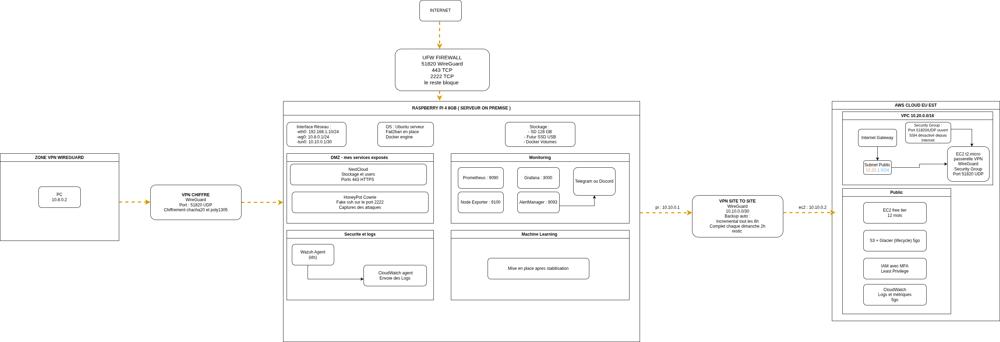

# Infrastructure Cloud Hybride - Raspberry Pi + AWS

> **Documentation technique détaillée disponible sur**

## Contexte du projet

Ce projet est né d'une volonté simple : comprendre concrètement comment fonctionne le cloud en le construisant moi-même, plutôt que de simplement consommer des services tout faits. L'idée initiale était pragmatique : avoir accès à un espace de stockage personnel de 512 Go via NextCloud, sans payer d'abonnement mensuel. Mais au fil du développement, le projet a naturellement évolué vers quelque chose de plus ambitieux.

J'ai rapidement réalisé que ce qui commençait comme un simple serveur de fichiers pouvait devenir une vraie plateforme d'apprentissage. Mettre en place un système de monitoring complet m'a permis de comprendre comment observer et diagnostiquer une infrastructure en production. L'intégration d'un SIEM avec Wazuh m'a ouvert les yeux sur la détection d'intrusion et l'analyse de logs en temps réel. Chaque composant ajouté répondait à une question technique que je me posais.

Au-delà de l'aspect technique, ce projet représente aussi une démarche professionnelle. En tant qu'étudiant en deuxième année de cybersécurité, je cherche une alternance en tant que Cloud Security Engineer pour 2026. Plutôt que de me contenter de suivre des cours théoriques, j'ai voulu créer un portfolio tangible qui démontre ma capacité à concevoir, déployer et sécuriser une infrastructure réelle.

## Architecture



### Composants principaux

L'infrastructure repose sur une architecture hybride combinant :

**Infrastructure locale (Raspberry Pi 4 - 8GB)**
- Bastion host sécurisé avec accès multi-facteur via VPN
- Trois tunnels WireGuard isolés pour différents niveaux d'accès
- Honeypot Cowrie pour observer les tentatives d'intrusion
- Point d'entrée unique vers les ressources cloud

**Infrastructure cloud (AWS EC2 c7i-flex.large)**
- NextCloud avec base de données PostgreSQL pour le stockage
- Stack de monitoring complète (Prometheus, Grafana, Node Exporter, cAdvisor)
- Wazuh SIEM pour la corrélation d'événements et la détection d'anomalies
- Isolation réseau via trois réseaux Docker distincts

### Principes d'architecture

J'ai appliqué une approche zero-trust dès la conception. Tous les accès passent obligatoirement par le Raspberry Pi qui fait office de bastion, avec authentification VPN avant même d'atteindre les services. Les réseaux Docker sont segmentés selon leur fonction : DMZ pour les services exposés, monitoring pour l'observabilité, et security pour les outils de sécurité.

La connexion site-to-site entre le Pi et AWS permet de créer un réseau privé virtuel unifié. Depuis mon poste de travail, je peux accéder à NextCloud comme si c'était un serveur local, alors qu'il tourne en réalité sur AWS. Cette configuration m'a permis de comprendre concrètement les concepts de VPN, de routage et de NAT.

## Ce que j'ai appris

### Réseau et connectivité

Configurer trois tunnels WireGuard distincts m'a forcé à vraiment comprendre le routage IP. J'ai dû gérer les tables de routage, configurer le NAT avec iptables, et résoudre des conflits de plages IP. Le plus formateur a été de debugger pourquoi un paquet n'arrivait pas à destination en analysant les logs et en traçant le chemin réseau.

### Sécurité opérationnelle

Mettre en place Wazuh m'a fait réaliser à quel point il y a du bruit dans les logs. J'ai dû apprendre à écrire des règles de corrélation pertinentes, à filtrer les faux positifs, et à créer des alertes actionnables. Le honeypot Cowrie a été révélateur : en quelques heures d'exposition, j'ai vu des dizaines de tentatives de connexion SSH automatisées. Cela rend très concret le concept de menace persistante.

### Infrastructure as Code

Tout documenter en Docker Compose et en configurations versionnées m'a appris la rigueur. Quand quelque chose casse, pouvoir revenir en arrière proprement est essentiel. J'ai aussi compris l'importance de séparer les secrets des configurations, d'où l'utilisation de variables d'environnement et de fichiers .env.

### Monitoring et observabilité

Prometheus et Grafana m'ont montré qu'observer une infrastructure, ce n'est pas juste "vérifier que ça marche". C'est comprendre les patterns normaux pour détecter les anomalies. J'ai créé des dashboards qui me permettent de voir en temps réel l'utilisation CPU, mémoire, réseau et disque. Quand NextCloud ralentit, je peux maintenant identifier si c'est un problème de base de données, de réseau ou de ressources.

## Structure du repository
```
.
├── architecture/          # Diagrammes et schémas d'architecture
├── config/
│   ├── docker/           # Docker Compose pour chaque stack
│   │   ├── dmz/          # Services exposés (NextCloud, Cowrie)
│   │   ├── monitoring/   # Prometheus, Grafana, exporters
│   │   └── security/     # Wazuh et outils de sécurité
│   └── wireguard/        # Configurations VPN (templates anonymisés)
├── scripts/              # Automation et intégrations
│   ├── duckdns.sh        # Mise à jour DNS dynamique
│   └── wazuh-telegram-alerte.py  # Alertes Telegram depuis Wazuh
└── docs/                 # Documentation détaillée
```

## Technologies utilisées

**Virtualisation et conteneurisation**
- Docker et Docker Compose pour l'isolation des services
- Réseaux Docker personnalisés pour la segmentation

**VPN et sécurité réseau**
- WireGuard pour trois tunnels VPN distincts
- UFW et iptables pour le filtrage réseau
- Cowrie comme honeypot SSH

**Monitoring et observabilité**
- Prometheus pour la collecte de métriques
- Grafana pour la visualisation
- Node Exporter et cAdvisor pour les métriques système et conteneurs
- Wazuh pour la corrélation de logs et SIEM

**Services applicatifs**
- NextCloud avec PostgreSQL pour le stockage cloud
- DuckDNS pour le DNS dynamique
- Intégrations Telegram pour les alertes temps réel

**Cloud provider**
- AWS EC2 pour la partie cloud
- VPC et groupes de sécurité pour l'isolation réseau

## Démarche de développement

J'ai commencé par le plus simple : installer NextCloud localement sur le Raspberry Pi. Une fois que j'ai compris comment ça fonctionnait, j'ai voulu y accéder depuis l'extérieur. C'est là que j'ai découvert les problématiques de sécurité : exposer directement des services sur internet, c'est prendre des risques énormes.

J'ai donc mis en place un premier tunnel VPN avec WireGuard. Puis je me suis rendu compte que mélanger accès personnel et accès depuis l'école sur le même tunnel n'était pas optimal. J'ai créé un second tunnel pour séparer les contextes d'utilisation. Le troisième tunnel vers AWS est venu naturellement quand j'ai voulu déplacer certains services dans le cloud tout en gardant une administration centralisée depuis le Pi.

Le monitoring est devenu nécessaire quand j'ai commencé à avoir des ralentissements sans savoir pourquoi. Installer Prometheus et Grafana m'a permis de voir que le problème venait des I/O disque sur la carte SD du Raspberry Pi. J'ai alors migré NextCloud sur AWS où les performances sont meilleures.

Wazuh est arrivé en dernier, quand je me suis demandé comment je pourrais détecter une intrusion si quelqu'un compromettait un service. L'intégration avec Telegram me permet de recevoir des alertes instantanément, ce qui transforme le système en un vrai outil de sécurité opérationnelle.

## Objectifs professionnels

Ce projet fait partie de ma préparation pour une alternance en Cloud Security Engineering. Plutôt que de simplement lister des compétences sur un CV, je voulais pouvoir montrer concrètement que je sais :

- Concevoir une architecture cloud sécurisée
- Mettre en place des mécanismes de défense en profondeur
- Monitorer et analyser une infrastructure en production
- Automatiser les tâches répétitives
- Documenter proprement mon travail

Le fait de tout versionner sur GitHub me permet aussi de montrer ma progression. Chaque commit représente une décision technique, parfois une erreur corrigée, parfois une amélioration. C'est cette transparence sur ma démarche d'apprentissage que je veux partager avec de futurs employeurs.

## Prochaines évolutions

Le projet n'est pas terminé. J'ai prévu d'ajouter :

- GitLab Runner pour un pipeline CI/CD complet
- HashiCorp Vault pour la gestion centralisée des secrets
- K3s pour expérimenter avec Kubernetes sur le Raspberry Pi
- Portainer pour simplifier la gestion des conteneurs

Chaque amélioration est une opportunité d'apprendre une nouvelle technologie et de renforcer mes compétences.

